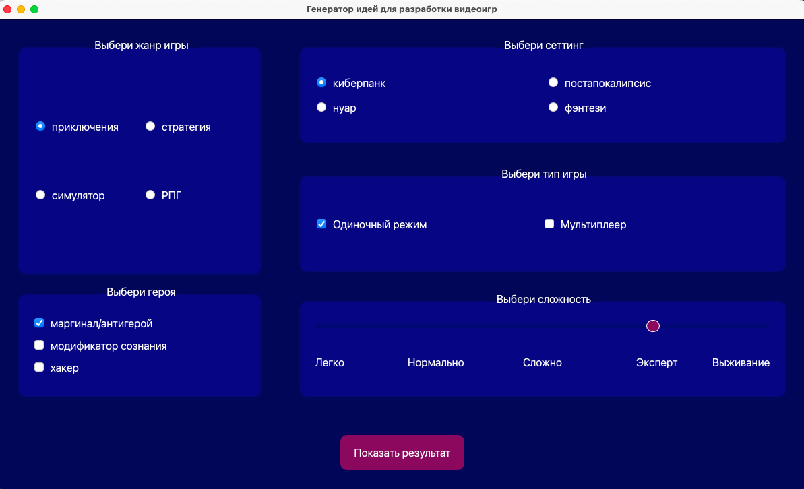

# Генератор креативных решений: проект оконного приложения на PyQt.

## О проекте

**Генератор креативных решений**


Поможем вам сгенерировать идеи игры на основе ваших пожеланий. Достаточно выбрать ваш любимый тип игры, заинтересовавший сеттинг и главного героя. Запускаете генератор креативных решений и начальная идея игры - уже у вас!

*очень бета-версия уже в репозитории, ура!*




### Как запустить проект

Склонировать код проекта локально:

```
git clone https://github.com/a-dagkes/pyqt_learn_example.git
```

Перейти в корневую директорию проекта:

```
cd pyqt_learn_example
```

Cоздать и активировать виртуальное окружение:

```
python -m venv env
```

* Если у вас Linux/macOS

    ```
    source env/bin/activate
    ```

* Если у вас windows

    ```
    venv\Scripts\activate
    ```


Обновить установщик Python пакетов pip до последней доступной версии:

```
python -m pip install --upgrade pip
```

Установить зависимости из файла requirements.txt:

```
pip install -r requirements.txt
```

* Запустить проект:

```
python main.py
```

##

Aia D, June developer
Anna K

**Проект в рамках курса Python-Интенсив.**
